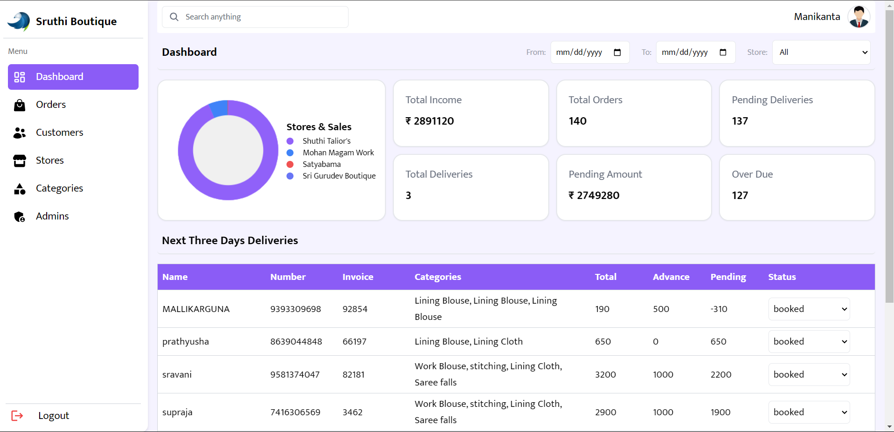
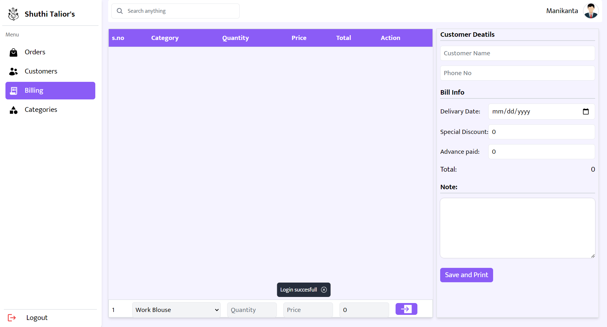

# Business Web Application for boutique
<p>The POS application for boutiques is a robust and scalable system developed using the MERN stack, aimed at efficiently managing various store operations. This document provides a detailed overview of the application's features, architecture, and functionalities. This website provides the advanced user interface for the management of complete boutique business including some of the important functions such as invoice generation, client data management and much more. Some of the technologoes used include React, Redux, Tailwind, etc.</p><br>
<p>You can take a look at the backend repository <a href="https://github.com/mani254/boutique-pos-backend">Here.</a> For the backend, technologies like Node.js, Express.js and MongoDB were used. </p>

## ⇛ Features
The website includes various features including :<br>

-**Graphical Indicators:** Visual representation of daily income and other metrics.<br>

-**User-friendly Interface:** Intuitive and easy-to-use interface with advanced filtering options.<br>

-**Multiple Stores:** Support for managing multiple stores within a single application.<br>

-**Invoice generation:** Generation of invoice including the price breakdown.<br>

-**Controlled Admin access:** Bifurcation of Access of profiles into SuperAdmin and StoreAdmin depending on the extent of access.<br>

## ⇛ Technologies Implemented
     

## Preview images
<div align="center">
  
  
</div><br>
For more images click on the specified link:<br>
1) <a href="https://github.com/mani254/boutique-pos-frontend/blob/main/demo/sample-images/AdminsManagement.png" target="blank">Admin Management page</a><br>
2) <a href="https://github.com/mani254/boutique-pos-frontend/blob/main/demo/sample-images/orders.png" target="blank">Orders page</a><br>
3) <a href="https://github.com/mani254/boutique-pos-frontend/blob/main/demo/sample-images/customers.png" target="blank">Customers page</a><br>
4) <a href="https://github.com/mani254/boutique-pos-frontend/blob/main/demo/sample-images/loginpage.png" target="blank">Login page</a><br>
5) <a href="https://github.com/mani254/boutique-pos-frontend/blob/main/demo/sample-images/invoice.pdf" target="blank">invoice</a><br>

## Installation
1) clone the repository
   ```
   git clone https://github.com/mani254/boutiques-pos-frontend
   ```
2) add `.env` file to the root directory and add the following data
   ```
   VITE_APP_FRONTENDURI = #AddYourFrontendURL;
   VITE_APP_BACKENDURI= #AddYourBackendURL;
   ```
3) intall the necessary packages
   ```
   npm install
   ```
4) run the file. note: make sure your backend is also running at the same time
   ```
   npm run dev 
   ```

